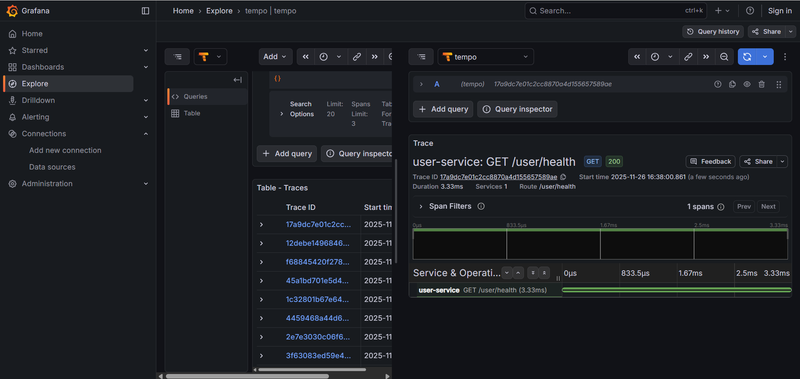
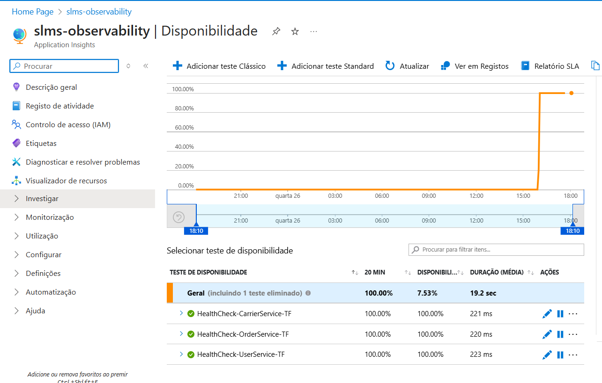
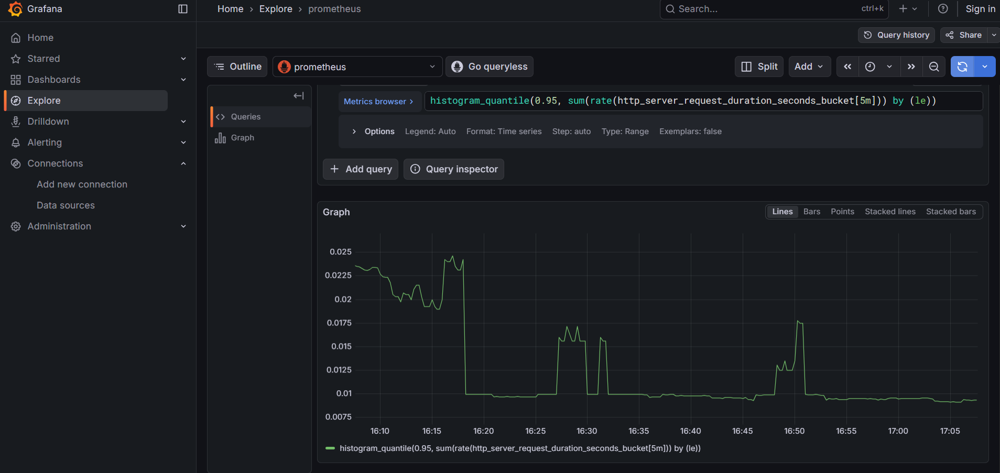
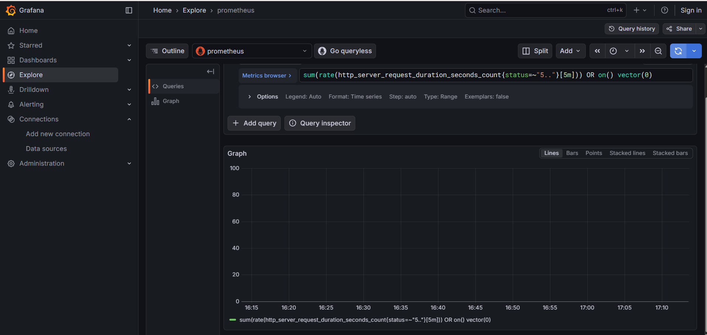

# Relatório de Observabilidade

## 1. Visão Geral da Implementação
A observabilidade foi implementada transversalmente no sistema (Backend e Frontend) utilizando o padrão **OpenTelemetry (OTel)** e o stack **LGTM** (Loki, Grafana, Tempo, Prometheus).

### Arquitetura
* **Recolha de Dados (Backend):** OpenTelemetry Java Agent/Starter nos microserviços Spring Boot (`user`, `carrier`, `order`).
* **Recolha de Dados (Frontend):** OpenTelemetry Web SDK (`@opentelemetry/sdk-trace-web`) na aplicação React para capturar interações do utilizador (cliques), carregamento de páginas e erros.
* **Agregação:** OpenTelemetry Collector (recebe OTLP gRPC/HTTP nas portas 4317/4318).
* **Logs Estruturados:** Loki (formato JSON via `logstash-logback-encoder` no backend e OTLP Log Exporter no frontend).
* **Métricas:** Prometheus (via endpoint `/actuator/prometheus`).
* **Traces Distribuídos:** Tempo (via OTLP export), permitindo rastreio "end-to-end" (do clique no browser até à base de dados).
* **Visualização:** Grafana (Dashboards e Explore).

## 2. Estratégia de Health Checks
A monitorização da saúde do sistema é feita em três camadas distintas para garantir redundância e auto-recuperação.

### 2.1 Nível do Contentor (Docker)
Cada serviço tem um `HEALTHCHECK` configurado no `docker-compose.yml`. Se falhar, o Docker reinicia o contentor automaticamente.
* **Comando:** `curl -f http://localhost:PORTA/actuator/health || exit 1`
* **Intervalo:** 30s

### 2.2 Nível da Aplicação (Spring Boot Actuator)
Os microserviços expõem endpoints detalhados que verificam a conectividade com a base de dados e outros componentes críticos.
* **Endpoint:** `/actuator/health`
* **Resposta Sucesso:** `200 OK {"status": "UP"}`

### 2.3 Nível de Infraestrutura (Azure Monitor)
O Azure Application Insights verifica a disponibilidade externa da VM e dos serviços através de Web Tests (Pings) a cada 5 minutos.

Foram configurados testes individuais para cada serviço crítico:
* **User Service:** `http://<VM_IP>:8082/user/health`
* **Order Service:** `http://<VM_IP>:8081/actuator/health`
* **Carrier Service:** `http://<VM_IP>:8080/actuator/health`

Critério de Sucesso: HTTP 200 OK.

## 3. SLIs e SLOs Definidos

| Serviço | SLI (Indicador) | SLO (Objetivo) | Query Prometheus / Racional |
| :--- | :--- | :--- | :--- |
| **Frontend** | Tempo de Carregamento (LCP) | < 2.5s (P75) | Core Web Vitals: Garantir boa experiência de utilização (UX). |
| **Frontend** | Taxa de Erros JS | < 1% das sessões | Garantir estabilidade da interface no browser do cliente. |
| **API Backend** | Taxa de Erros HTTP | < 1% erros (5xx) | `sum(rate(http_server_request_duration_seconds_count{status=~"5.."}[5m]))` |
| **API Backend** | Latência Global (P95) | 95% < 500ms | `histogram_quantile(0.95, sum(rate(http_server_request_duration_seconds_bucket[5m])) by (le))` |
| **Infraestrutura** | Uptime (Disponibilidade) | > 99.9% | `up` |

## 4. Configuração Técnica
* **Persistência:** Volumes Docker configurados para Loki (`loki-data`) e Grafana (`grafana-data`) para garantir que logs e dashboards sobrevivem a reinícios.
* **Tracing:** Sampling configurado para `always_on` (100%) em ambiente de desenvolvimento para garantir visibilidade total.
* **CORS:** OpenTelemetry Collector configurado para aceitar telemetria vinda do browser (Frontend).
* **Segurança:** Endpoints de observabilidade (`/actuator/**`, `/health`) configurados como públicos no Spring Security para permitir monitorização sem autenticação.

## 5. Evidências de Validação

### A. Logs Estruturados (Loki)
Os logs são gerados em formato JSON para facilitar a indexação por campos (`service_name`, `trace_id`, `level`).
> **Evidência:**
> 

### B. Traces Distribuídos (Tempo)
Rastreio completo do ciclo de vida dos pedidos HTTP através dos microserviços.
> **Evidência:**
> 

### C. Métricas (Prometheus)
Monitorização de tráfego e contagem de pedidos em tempo real.
> **Evidência:**
> 

### D. Monitorização de Infraestrutura (Azure)
Teste de disponibilidade configurado no Application Insights para validar o acesso externo à VM.
> **Evidência:**
> 
> *(O gráfico demonstra que os testes foram implementados com sucesso e todos os serviços estão a responder com OK).*

### E. Validação de SLO (Latência)
Validação do SLO de latência (< 200ms) utilizando a função `histogram_quantile` no Prometheus.
> **Evidência:**
> 
> *(O gráfico demonstra uma latência P95 consistentemente abaixo de 30ms, cumprindo o objetivo).*

### F. Validação de SLO (Taxa de Erros)
Monitorização da taxa de erros HTTP 5xx (Server Errors).
> **Evidência:**
> 
> *(O gráfico demonstra uma taxa de erros de 0 absoluto, cumprindo largamente o objetivo de < 1%).*

## 6. Como Aceder
1.  **Aplicação (Frontend/Backend):** `http://4.233.56.74` (Frontend na porta 80, Backend nas portas 8080-8082).
2.  **Grafana (Observabilidade):** `http://4.233.56.74:3000`.
3.  **Azure Portal:** Resource Group `slms-rg` > Application Insights `slms-observability`.